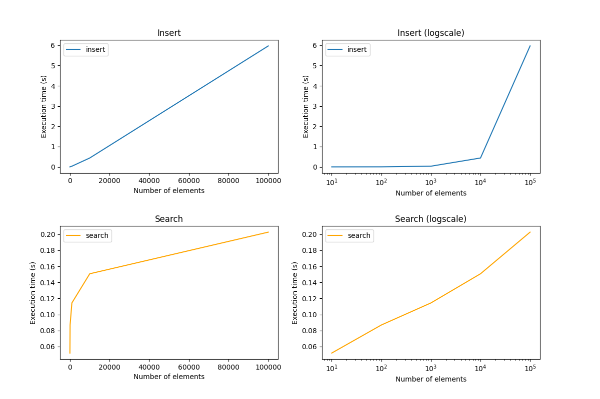
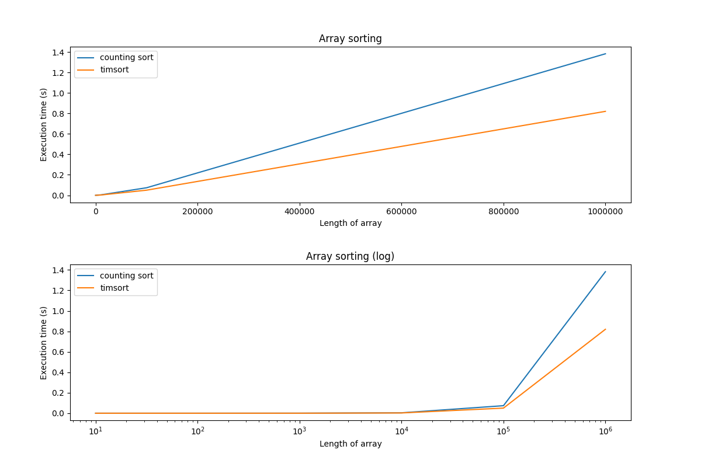

# Data structures and Algorithms

Defining time complexity of insert and search in Balanced Binary Search Tree and comparing counting sort with timsort, finding week points.

### Requirements:
 - [docker](https://docs.docker.com/get-docker/) >20.10.7
 - [docker-compose](https://docs.docker.com/compose/install/) >2.1.0
 
### Setup

To be able to run the code you just need to build a container with next command:

```bash
docker-compose build
```

### Balanced Binary Search Tree

To check the complexity of search and insert in BBST just need to run next command: 

```
docker-compose run --rm app python /app/bst.py

+------------------+-----------------+-----------------+
| number of values | insert duration | search duration |
+------------------+-----------------+-----------------+
| 10               |  0:00:00.000129 |  0:00:00.052197 |
| 100              |  0:00:00.002223 |  0:00:00.082910 |
| 1000             |  0:00:00.032231 |  0:00:00.113137 |
| 10000            |  0:00:00.444889 |  0:00:00.151579 |
+------------------+-----------------+-----------------+
```

Result shows that insertion time complexity grows linear with the increase of tree size. However, the search time increases logarithmically.



## Counting Sort algorithm

Comparison of counting sort and timsort (standard for Python) algorithms on arrays of N elements (from 1 to N) shows that they have similar performance and time complexity in this case. 



But, despite the fact that counting sort similar to timsort results on regular array, counting sort algorithm have a huge problem with small arrays with integers with big range, as we can se from following results:  

```
docker-compose run --rm app python /app/counting_sort.py

+-----------------+----------------+----------------+
| array           | counting sort  |    timsort     |
+-----------------+----------------+----------------+
| 10 elements     | 0:00:00.000009 | 0:00:00.000002 |
| 100 elements    | 0:00:00.000041 | 0:00:00.000014 |
| 1000 elements   | 0:00:00.000411 | 0:00:00.000217 |
| 10000 elements  | 0:00:00.004322 | 0:00:00.002797 |
| 100000 elements | 0:00:00.073547 | 0:00:00.048436 |
+-----------------+----------------+----------------+
+-------------+----------------+----------------+
| array       | counting sort  |    timsort     |
+-------------+----------------+----------------+
| [1, 10]     | 0:00:00.000006 | 0:00:00.000002 |
| [1, 1000]   | 0:00:00.000113 | 0:00:00.000001 |
| [1, 100000] | 0:00:00.010891 | 0:00:00.000002 |
+-------------+----------------+----------------+
```

Counting sort horrible performing on array with just two elements with big gap, while timsort perform well.